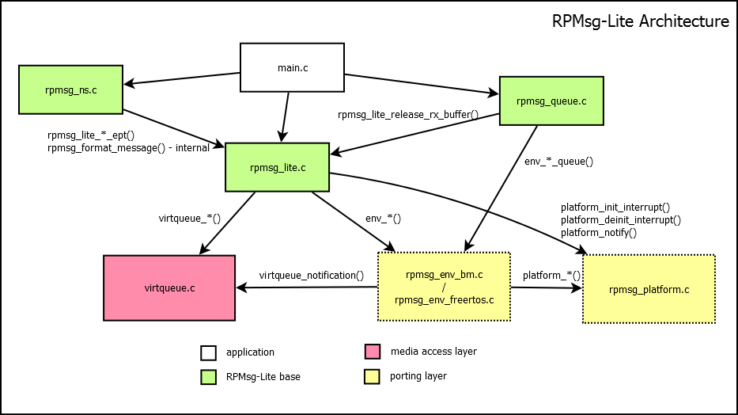
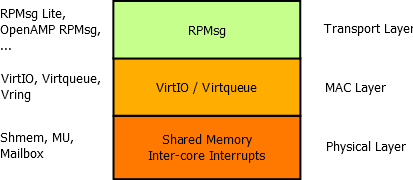
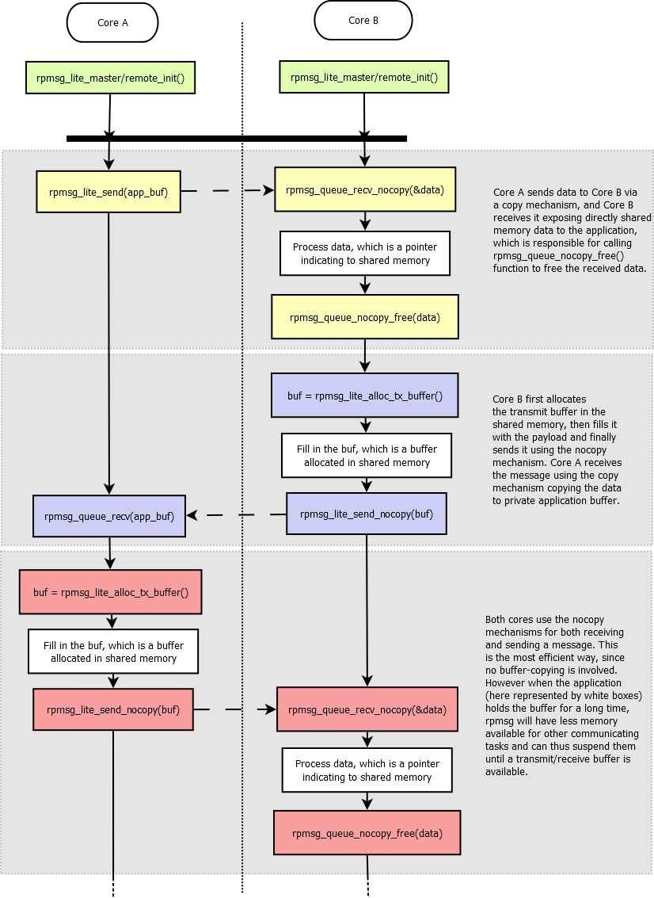

RPMsg Component                         {#mainpage}
===============

This documentation describes the RPMsg-Lite component, which is a lightweight implementation of the Remote Processor Messaging (RPMsg) protocol. The RPMsg protocol defines a standardized binary interface used to communicate between multiple cores in a heterogeneous multicore system.

Compared to the RPMsg implementation of the Open Asymmetric Multi Processing (OpenAMP) framework (https://github.com/OpenAMP/open-amp), the RPMsg-Lite offers a code size reduction, API simplification, and improved modularity. On smaller Cortex-M0+ based systems, it is recommended to use RPMsg-Lite.

The RPMsg-Lite is an open-source component developed by NXP Semiconductors and released under the BSD-compatible license.

# Motivation to create RPMsg-Lite {#motivation}

There are multiple reasons why RPMsg-Lite was developed. One reason is the need for the small footprint of the RPMsg protocol-compatible communication component, another reason is the simplification of extensive API of OpenAMP RPMsg implementation.

RPMsg protocol was not documented, and its only definition was given by the Linux Kernel and legacy OpenAMP implementations. This has changed with [1] which is a standardization protocol allowing multiple different implementations to coexist and still be mutually compatible.

Small MCU-based systems often do not implement dynamic memory allocation. The creation of static API in RPMsg-Lite enables another reduction of resource usage. Not only does the dynamic allocation adds another 5 KB of code size, but also communication is slower and less deterministic, which is a property introduced by dynamic memory. The following table shows some rough comparison data between the OpenAMP RPMsg implementation and new RPMsg-Lite implementation:

|Component / Configuration                   | Flash [B] |RAM [B]        |
|---------------------------------------------|-----------|---------------|
|OpenAMP RPMsg / Release (reference)          | 5547      | 456 + dynamic |
|RPMsg-Lite / Dynamic API, Release            | 3462      | 56 + dynamic  |
|Relative Difference [%]                      | ~62.4%    | ~12.3%        |
|RPMsg-Lite / Static API (no malloc), Release | 2926      | 352           |
|Relative Difference [%]                      | ~52.7%    | ~77.2%        |

# Implementation {#implementation}

The implementation of RPMsg-Lite can be divided into three sub-components, from which two are optional. The core component is situated in <i>rpmsg_lite.c</i>. Two optional components are used to implement a blocking receive API (in <i>rpmsg_queue.c</i>) and dynamic "named" endpoint creation and deletion announcement service (in <i>rpmsg_ns.c</i>).

The actual "media access" layer is implemented in <i>virtqueue.c</i>, which is one of the few files shared with the OpenAMP implementation. This layer mainly defines the shared memory model, and internally defines used components such as vring or virtqueue.

The porting layer is split into two sub-layers: the environment layer and the platform layer. The first sublayer is to be implemented separately for each environment. (The bare metal environment already exists and is implemented in <i>rpmsg_env_bm.c</i>, and the FreeRTOS environment is implemented in <i>rpmsg_env_freertos.c</i> etc.) Only the source file, which matches the used environment, is included in the target application project. The second sublayer is implemented in <i>rpmsg_platform.c</i> and defines low-level functions for interrupt enabling, disabling, and triggering mainly. The situation is described in the following figure:

## RPMsg-Lite core sub-component {#rpmsg_lite_core}

This subcomponent implements a blocking send API and callback-based receive API. The RPMsg protocol is part of the transport layer. This is realized by using so-called endpoints. Each endpoint can be assigned a different receive callback function. However, it is important to notice that the callback is executed in an interrupt environment in current design. Therefore, certain actions like memory allocation are discouraged to execute in the callback. The following figure shows the role of RPMsg in an ISO/OSI-like layered model:

## Queue sub-component (optional) {#rpmsg_queue}

This subcomponent is optional and requires implementation of the env_*_queue() functions in the environment porting layer. It uses a blocking receive API, which is common in RTOS-environments. It supports both copy and nocopy blocking receive functions.

## Name Service sub-component (optional) {#rpmsg_nameservice}

This subcomponent is a minimum implementation of the name service which is present in the Linux Kernel implementation of RPMsg. It allows the communicating node both to send announcements about "named" endpoint (in other words, channel) creation or deletion and to receive these announcement taking any user-defined action in an application callback. The endpoint address used to receive name service announcements is arbitrarily fixed to be 53 (0x35).

# Usage {#usage}

The application should put the /rpmsg_lite/lib/include directory to the include path and in the application, include either the rpmsg_lite.h header file, or optionally also include the rpmsg_queue.h and/or rpmsg_ns.h files. Both porting sublayers should be provided for you by NXP, but if you plan to use your own RTOS, all you need to do is to implement your own environment layer (in other words, rpmsg_env_myrtos.c) and to include it in the project build.

The initialization of the stack is done by calling the rpmsg_lite_master_init() on the master side and the rpmsg_lite_remote_init() on the remote side. This initialization function must be called prior to any RPMsg-Lite API call. After the init, it is wise to create a communication endpoint, otherwise communication is not possible. This can be done by calling the rpmsg_lite_create_ept() function. It optionally accepts a last argument, where an internal context of the endpoint is created, just in case the RL_USE_STATIC_API option is set to 1. If not, the stack internally calls env_alloc() to allocate dynamic memory for it. In case a callback-based receiving is to be used, an ISR-callback is registered to each new endpoint with user-defined callback data pointer. If a blocking receive is desired (in case of RTOS environment), the rpmsg_queue_create() function must be called before calling rpmsg_lite_create_ept(). The queue handle is passed to the endpoint creation function as a callback data argument and the callback function is set to rpmsg_queue_rx_cb(). Then, it is possible to use rpmsg_queue_receive() function to listen on a queue object for incoming messages. The rpmsg_lite_send() function is used to send messages to the other side.

The RPMsg-Lite also implements no-copy mechanisms for both sending and receiving operations. These methods require
specifics that have to be considered when used in an application.

<b>no-copy-send mechanism:</b> This mechanism allows sending messages without the cost for copying data from the application
buffer to the RPMsg/virtio buffer in the shared memory. The sequence of no-copy sending steps to be performed is as follows:
- Call the rpmsg_lite_alloc_tx_buffer() function to get the virtio buffer and provide the buffer pointer to the application.
- Fill the data to be sent into the pre-allocated virtio buffer. Ensure that the filled data does not exceed the buffer size
(provided as the rpmsg_lite_alloc_tx_buffer() <i>size</i> output parameter).
- Call the rpmsg_lite_send_nocopy() function to send the message to the destination endpoint. Consider the cache
functionality and the virtio buffer alignment. See the rpmsg_lite_send_nocopy() function description below.

<b>no-copy-receive mechanism:</b> This mechanism allows reading messages without the cost for copying data from the virtio
buffer in the shared memory to the application buffer. The sequence of no-copy receiving steps to be performed is as follows:
- Call the rpmsg_queue_recv_nocopy() function to get the virtio buffer pointer to the received data.
- Read received data directly from the shared memory.
- Call the rpmsg_queue_nocopy_free() function to release the virtio buffer and to make it available for the next data transfer.

The user is responsible for destroying any RPMsg-Lite objects he has created in case of deinitialization. In order to do this, the function rpmsg_queue_destroy() is used to destroy a queue, rpmsg_lite_destroy_ept() is used to destroy an endpoint and finally, rpmsg_lite_deinit() is used to deinitialize the RPMsg-Lite intercore communication stack. Deinitialize all endpoints using a queue before deinitializing the queue. Otherwise, you are actively invalidating the used queue handle, which is not allowed. RPMsg-Lite does not check this internally, since its main aim is to be lightweight.

# Configuration options {#configuration}

The RPMsg-Lite can be configured at the compile time. The default configuration is defined in the rpmsg_default_config.h header file. This configuration can be customized by the user by including rpmsg_config.h file with custom settings. The following table summarizes all possible RPMsg-Lite configuration options.

| Configuration option         | Default value | Usage     |
|------------------------------|---------------|-----------|
|RL_MS_PER_INTERVAL            | (1)           | Delay in milliseconds used in non-blocking API functions for polling.      |
|RL_BUFFER_PAYLOAD_SIZE        | (496)         | Size of the buffer payload, it must be equal to (240, 496, 1008, ...) [2^n - 16]   |
|RL_BUFFER_COUNT               | (2)           | Number of the buffers, it must be power of two (2, 4, ...)      |
|RL_API_HAS_ZEROCOPY           | (1)           | Zero-copy API functions enabled/disabled.          |
|RL_USE_STATIC_API             | (0)           | Static API functions (no dynamic allocation) enabled/disabled.    |
|RL_CLEAR_USED_BUFFERS         | (0)           | Clearing used buffers before returning back to the pool of free buffers enabled/disabled.   |
|RL_USE_MCMGR_IPC_ISR_HANDLER  | (0)           | When enabled IPC interrupts are managed by the Multicore Manager (IPC interrupts router), when disabled RPMsg-Lite manages IPC interrupts by itself.   |
|RL_USE_ENVIRONMENT_CONTEXT    | (0)           | When enabled the environment layer uses its own context. Required for some environments (QNX). The default value is 0 (no context, saves some RAM).    |
|RL_DEBUG_CHECK_BUFFERS        | (0)           | When enabled buffer debug checks in rpmsg_lite_send_nocopy() and rpmsg_lite_release_rx_buffer() functions are disabled. Do not use in RPMsg-Lite to Linux configuration.    |
|RL_ALLOW_CONSUMED_BUFFERS_NOTIFICATION        | (0)           | When enabled the opposite side is notified each time received buffers are consumed and put into the queue of available buffers. Enable this option in RPMsg-Lite to Linux configuration to allow unblocking of the Linux blocking send. The default value is 0 (RPMsg-Lite to RPMsg-Lite communication).    |
|RL_ALLOW_CUSTOM_SHMEM_CONFIG  | (0)           | It allows to define custom shared memory configuration and replacing the shared memory related global settings from rpmsg_config.h This is useful when multiple instances are running in parallel but different shared memory arrangement (vring size & alignment, buffers size & count) is required. The default value is 0 (all RPMsg_Lite instances use the same shared memory arrangement as defined by common config macros). |
|RL_ASSERT                     | see rpmsg_default_config.h | Assert implementation.    |

# References {#references}
[1] M. Novak, M. Cingel, Lockless Shared Memory Based Multicore Communication Protocol

# Revision History {#revision_history}

This table summarizes revisions of this document.

|Revision number| Date    |Substantive changes                       |
|---------------|---------|------------------------------------------|
|1.0            | 09/2016 | Initial release                          |
|2.0            | 02/2017 | Added macros for packed structures (compiler.h) 
 Improved interrupt handling in platform layer 
 Changed RL_BUFFER_SIZE definition 
 Fix of double initialization of vring shared data structure 
 Support for the multi-instance 
 Simplified virtqueue.c, removing race condition|
|3.0            | 08/2017 | Several source files renamed to avoid conflicts with other middleware software components 
 Added user data into RPMsg Nameservice callback 
 Added the RL_CLEAR_USED_BUFFERS configuration option to allow clearing used buffers before returning back to the pool of free buffers 
 Added the ability to use Multicore Manager (MCMGR) as the IPC interrupts router (RL_USE_MCMGR_IPC_ISR_HANDLER config) |
|4.0            | 04/2018 | New API rpmsg_queue_get_current_size() 
 Fixed bug in interrupt handling for lpc5411x, lpc5410x 
 Code adjustments based on static analysis tool findings |
|5.0            | 09/2018 | Align porting layers to the updated MCUXpressoSDK feature files 
 Allow rpmsg-lite build by Keil MDK ArmClangV6 compiler  |
|6.0            | 04/2019 | Added configuration macro RL_DEBUG_CHECK_BUFFERS 
 Several MISRA violations fixed 
 Added environment layers for QNX and Zephyr 
 Allow environment context required for some environments (controlled by the RL_USE_ENVIRONMENT_CONTEXT configuration macro).  |
|7.0            | 11/2019 | MISRA C-2012 violations fixed, incl. data types consolidation 
 Code formatted.  |
|8.0            | 04/2020 | MISRA C-2012 violations fixed (7.4) 
 Fix missing lock in rpmsg_lite_rx_callback() for QNX env 
 Correction of rpmsg_lite_instance structure members description 
 Address -Waddress-of-packed-member warnings in GCC9 
 Clang update to v10.0.0, code re-formatted.  |
|9.0            | 12/2020 | Several MISRA C-2012 violations addressed 
 Introduced RL_ALLOW_CONSUMED_BUFFERS_NOTIFICATION config option to allow opposite side notification sending each time received buffers are consumed and put into the queue of available buffers 
 Added environment layers for Threadx 
 Added support for i.MX8QM multicore platform  |
|10.0           | 06/2021 | Fixed incorrect description of the rpmsg_lite_get_endpoint_from_addr function 
 Updated RL_BUFFER_COUNT documentation 
 env_print macro adjusted to address MISRA 21.6 rule in MCUXpressoSDK projects  |
|11.0           | 12/2021 | Improve static allocations - allow OS-specific objects being allocated statically, GitHub PR #14 
 RPMsg-Lite: Minor Misra and typo corrections, GitHub PR #19, #20.  |
|12.0           | 01/2022 | Introduce RL_ALLOW_CUSTOM_SHMEM_CONFIG configuration option to support custom shared memory arangement per the RPMsg_Lite instance.  |
|13.0           | 04/2022 | Introduced new rpmsg_lite_wait_for_link_up() API function - this allows to avoid using busy loops in rtos environments, GitHub PR #21. 
 Adjust rpmsg_lite_is_link_up() to return RL_TRUE/RL_FALSE.  |

